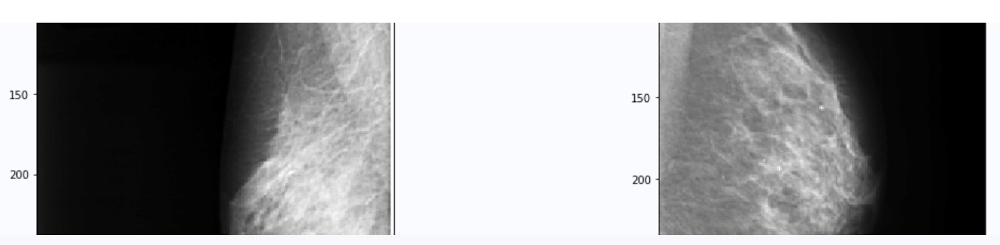

# CBIS-DDSM 乳腺 X 光片识别项目

## 一、项目背景介绍

中国正在进入老龄化社会，而我们的社会医疗资源严重缺乏，同时也出现医疗水平不平衡的情况。对于病人很多疾病如果发现的早，结果截然不同。如果有一种医疗辅助APP可以帮助人们 早期检测，例如每年的体检数据。通常人们都是自己评估自己的健康情况，而普通人没有相关医疗常识，所以很多“亲友团群”的偏方盛行：），我们可以通过医疗辅助APP，早期预警健康风险。

## 二、数据介绍

CBIS-DDSM（DDSM 的精选乳房成像子集）是 用于筛查乳房 X 光检查的数字数据库 (DDSM)的更新和标准化版本。DDSM 是一个包含 2,620 项扫描胶片乳腺摄影研究的数据库。它包含具有经过验证的病理信息的正常、良性和恶性病例。



## 三、模型介绍

使用 paddlehub "resnet50_vd_imagenet_ssld" 模型 Fine-tune 训练

```
#加载预训练模型
model = hub.Module(name="resnet50_vd_imagenet_ssld", label_list=class_names)
```

## 四、模型训练¶

- 优化器选择 Ada会动态调节合适的 learning rate 以加快模型收敛
- 由于 DDSM 数据集与 ImageNet 数据集相差较大,同时训练数据量为9K,所以基于预训练模型参数 Fine-tune 训练模型参数

 |数据集|相似度低|相似度高|
 |---------|--------|--------|
 |大|Fine-tune| **Fine-tuen or Retrain**|
 |小| End of NN| Start of ConvNet|

- 该模型使用 GUP 训练, 讲训练过程中的参数存储在 'img_classification_ckpt'

```
#选择优化策略和运行配置
optimizer = paddle.optimizer.Adam(learning_rate=0.001, parameters=model.parameters())
trainer = Trainer(model, optimizer, use_gpu=True, checkpoint_dir='img_classification_ckpt')
trainer.train(train_dataset, epochs=100, batch_size=BATCH_SIZE, eval_dataset=val_dataset, log_interval=10, save_interval=1)
```

## 五、模型评估

模型在验证集达到acc = 0.9625 而在测试集 acc = 0.6742 ,说明模型有过拟合情况, 需要使用 Droput 或者 Early stopping L1, L2, 我需要继续研究如何在 paddleHub trianer中使用

```
[2022-02-22 18:11:15,022] [   TRAIN] - Epoch=100/100, Step=240/241 loss=0.1000 acc=0.9625 lr=0.001000 step/sec=4.92 | ETA 01:29:38

{'loss': 2.2339701627494257,
 'metrics': defaultdict(int, {'acc': 0.674233825198638})}
```

## 六、总结

训练模型以准确率(accuracy)为衡量标准,医学任务应该采用查全率(recall)做为模型的衡量标准,但是在'paddleHub fine-tune trianer api' 中我没有找到相关用法,需继续研究这部分内容

## 相关资源

- 更多深度学习知识、产业案例，请参考：[awesome-DeepLearning](https://github.com/paddlepaddle/awesome-DeepLearning)

- 更多预训练模型(图像、文本、语音、视频等)，请参考：[PaddleHub](https://github.com/PaddlePaddle/PaddleHub)

- 飞桨框架相关资料，请参考：[飞桨深度学习平台](https://www.paddlepaddle.org.cn/?fr=paddleEdu_aistudio)

## 版本

版本遵循 SemVer 规则

## 作者

Tom Ge - 数据科学

This project is licensed under the MIT License
